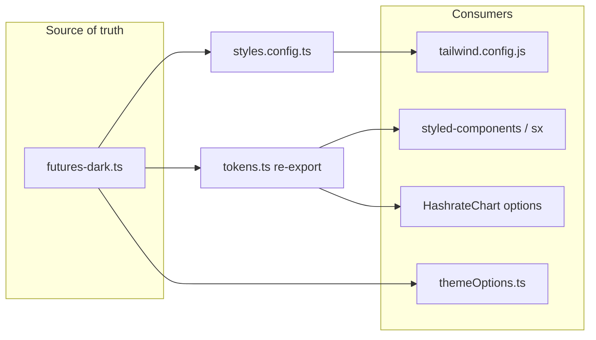

# Parameterize colors (compile-time schemes)

## Approach

- **Single source of truth**: A dedicated scheme module (e.g. `[ui/src/styles/schemes/futures-dark.ts](ui/src/styles/schemes/futures-dark.ts)`) exports a **structured** token object (`text`, `surface`, `trading`, `border`, `accent`, `chart`, `semantic`, etc.) plus a **flattened** map for Tailwind keys (kebab-case names like `futures-app-bg`, `futures-text-muted`).
- **Merge with existing**: `[ui/src/styles/styles.config.ts](ui/src/styles/styles.config.ts)` re-exports `colors` = `{ ...existingLumerinColors, ...schemeFlattened }`. You can **override** any existing `lumerin-*` key here by placing scheme keys second (or explicitly merging in order you prefer).
- **Tailwind**: `[ui/tailwind.config.js](ui/tailwind.config.js)` keeps `require("./src/styles/styles.config")` — no path change; only the exported `colors` object grows.
- **MUI**: Extend `[ui/src/styles/themeOptions.ts](ui/src/styles/themeOptions.ts)` so component overrides (e.g. autofill `WebkitBoxShadow`) use token values instead of raw hex. Optional: add a `palette` field for a few MUI defaults; most futures UI today uses styled-components / `sx` with literals, so **direct `import { tokens } from '...'`** is the primary pattern (simpler than module augmentation for 50+ files).
- **Global background**: Today `[ui/src/index.css](ui/src/index.css)` sets `html, body { background-color: #1e1e1e }`. Move that to the **root layout** using `tokens` (e.g. `App.tsx` or a top-level `Box`/`div` with `sx`/`style`) so the value is not duplicated in CSS, **or** keep one line in `index.css` that references a class applied from React — the goal is **one literal** in the scheme file only.
- **RGBA / alpha**: Prefer **named tokens** for repeated combos (e.g. `borderMuted`, `overlayWhite05`) and a tiny `**withAlpha(hex, a)`** helper (or use `@mui/material/styles` `alpha()`) for the long tail so you do not scatter `rgba(...)` literals.

## Token naming (illustrative)

Group repeated values from the prior audit into semantic names, for example:

- **App / surfaces**: `appBg`, `panel`, `tabActive`, `tabHover`, `tabDisabled`, `inputIslandBg`, `tooltipBg`, `alertBg`.
- **Text**: `textPrimary`, `textSecondary` (`#a7a9b6`), `textMuted` (`#6b7280`), `navIcon` (`#c2c9d6`).
- **Borders / accents**: `borderDefault` (171,171,171 family), `accent` (`#509EBA`), `focusRing` (same as accent where used).
- **Trading**: `long`, `short`, `longHover`, `shortHover`, `warning`, `highlight`, `info`, plus matching **alpha** variants for row backgrounds.
- **Charts**: `chartGrid`, `chartAxis`, `seriesBtc` (`#f7931a`), etc.

Exact names are flexible; consistency matters more than perfect taxonomy.

## Migration sweep (order)

1. **Infrastructure**: Add `schemes/futures-dark.ts`, `tokens.ts` (barrel: `export const tokens = futuresDark` for now), refactor `styles.config.ts` merge, fix `index.css` / `App.tsx` background.
2. **High-churn futures widgets**: `[PlaceOrderWidget.tsx](ui/src/components/Widgets/Futures/PlaceOrderWidget.tsx)`, `[PerpsOrderFormFields.tsx](ui/src/components/Widgets/Futures/PerpsOrderFormFields.tsx)`, `[PerpsOrdersPositionsTabWidget.tsx](ui/src/components/Widgets/Futures/PerpsOrdersPositionsTabWidget.tsx)`, `[OrdersPositionsTabWidget.tsx](ui/src/components/Widgets/Futures/OrdersPositionsTabWidget.tsx)`, `[TradingHeader.tsx](ui/src/components/Widgets/Futures/TradingHeader.tsx)`, balance widgets, order book, feed.
3. **Charts**: `[HashrateChart.tsx](ui/src/components/Charts/HashrateChart.tsx)` — replace option object colors with `tokens.chart.`*.
4. **Shared UI**: `[Table.tsx](ui/src/components/Table.tsx)`, `[Modal.styled.tsx](ui/src/components/Modal.styled.tsx)`, `[TabSwitch.tsx](ui/src/components/TabSwitch.tsx)`, `[Navigation.tsx](ui/src/components/Navigation/Navigation.tsx)`, `[Footer.tsx](ui/src/components/Footer.tsx)`, forms under `[Forms/](ui/src/components/Forms/)`.
5. **Edge / one-offs**: Replace `color: "blue"` (`[ErrorPage.tsx](ui/src/components/ErrorPage.tsx)`), `"white"` where you want tokens, `[PurchasedContracts.tsx](ui/src/components/Cards/PurchasedContracts.tsx)` `#ff3b3b` → semantic `error` or `iconDanger`, `[Marketplace.tsx](ui/src/pages/marketplace/Marketplace.tsx)` inline chart colors.

## Second scheme later

Add `ui/src/styles/schemes/futures-light.ts` (or `brand-b.ts`) with the **same shape** as `futures-dark`. Switch active scheme by changing **one** re-export in `tokens.ts` (and rebuilding). No runtime provider required.

## Verification

- Grep the `ui/src` tree for `#([0-9a-fA-F]{3,8})` and `rgba?(` after migration; only the scheme file(s) and alpha helper should contain raw values (or zero literals if even those go through helpers).
- Run existing UI build/lint; spot-check futures and marketplace routes.

## Files likely touched (non-exhaustive)

- New: `ui/src/styles/schemes/futures-dark.ts`, `ui/src/styles/tokens.ts` (optional `color-utils.ts` for `withAlpha`).
- Edit: `[ui/src/styles/styles.config.ts](ui/src/styles/styles.config.ts)`, `[ui/src/styles/themeOptions.ts](ui/src/styles/themeOptions.ts)`, `[ui/src/index.css](ui/src/index.css)`, `[ui/src/App.tsx](ui/src/App.tsx)`, and ~50 component files previously identified with hex/rgb usage.

