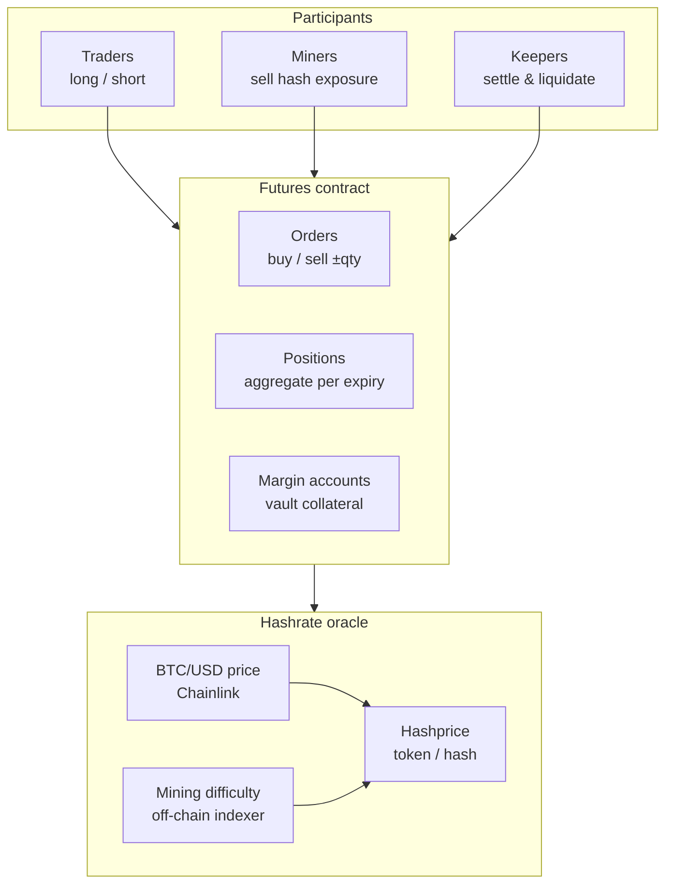

# HPDX Hashprice Futures

Decentralized Futures Market for Bitcoin Hashrate

> **Published documentation:** [gitbook.hashpower.io](https://gitbook.hashpower.io)

---

## Introduction

HPDX Hashprice Futures is a decentralized derivatives protocol enabling participants to trade standardized, cash-settled contracts on future Bitcoin mining hashprice. Built on EVM-compatible blockchains, it provides a trustless marketplace where miners can hedge their production and traders can gain exposure to hashrate as an asset class.

The protocol uses an automated order matching engine with a fixed price grid, collateralized margin accounts, and Chainlink-powered oracles for real-time hashprice discovery.

## Key Features

| Feature                        | Description                                                      |
| ------------------------------ | ---------------------------------------------------------------- |
| **Standardized Contracts**     | Fixed hashrate speed (TH/s) per contract unit                    |
| **Multiple Maturity Dates**    | Trade contracts maturing on configurable future dates            |
| **Margin-Based Trading**       | Collateralized positions with automated risk management          |
| **Cash Settlement**            | Positions are marked to the oracle price at maturity             |
| **Decentralized Oracles**      | Real-time hashprice derived from BTC price and mining difficulty |
| **Automated Liquidation**      | Margin call system prevents counterparty defaults                |

## Architecture

## How It Works

### 1. Deposit Collateral

Participants deposit the settlement token (e.g., USDC) into the Collateral Vault used by Futures.

### 2. Place Orders

Create buy (long) or sell (short) orders via `createOrder(price, deliveryAt, quantity)`:

- **Price**: Hashprice in settlement tokens
- **Maturity Date**: When the contract matures (`deliveryAt`)
- **Quantity**: Signed whole contracts (`+` long / `−` short)

### 3. Order Matching

Orders are matched automatically when opposing orders exist at the same price and maturity date. The matching follows a **FIFO (First-In-First-Out)** queue, ensuring fair price-time priority.

### 4. Position Management

Once matched, positions are held until either:

- **Closed Before Maturity**: User exits by placing an opposite order
- **Maturity**: The position becomes settleable at the oracle mark price
- **Liquidation**: Margin call triggered due to insufficient collateral

### 5. Settlement

At maturity (`block.timestamp >= deliveryAt`):

- The position is **cash-settled**: its full notional is marked to the HPDX Hashprice Oracle price (`getMarketPrice()`) and PnL is routed through the insurance fund
- Settlement is **permissionless** — anyone (typically a keeper) can call `settlePosition(positionId)` (or batch `settlePositions(...)`); a matured position can be settled any time after maturity
- See [Settlement](./05.Delivery-Settlement.md) for full details

## Deployed Contracts (dev)

| Network      | Chain ID | Application                              | Futures Contract                             | Hashprice Oracle                             |
| ------------ | -------- | ---------------------------------------- | -------------------------------------------- | -------------------------------------------- |
| Base Sepolia | `84532`  | https://dev.hashpower.exchange/futures | `0x56d8d4a03a0f34b93b86e0b7941aff29178d0479` | `0x6f501d6ea22c910e657ad3650f45a76dc525e387` |

Explorer: [Base Sepolia](https://sepolia.basescan.org)

## Documentation

| Document                                                   | Description                                       |
| ---------------------------------------------------------- | ------------------------------------------------- |
| [Contract Specifications](./02.Contract-Specifications.md) | Detailed contract parameters and mechanics        |
| [Margin System](./03.Margin-System.md)                     | Margin requirements, maintenance, and liquidation |
| [Trading Guide](./04.Trading-Guide.md)                     | How to create orders and manage positions         |
| [Settlement](./05.Delivery-Settlement.md)                  | Cash settlement of positions at maturity          |

## Security Considerations

- **Upgradeable**: Uses UUPS proxy pattern for bug fixes and improvements
- **Access Control**: Admin parameters restricted to the owner; settlement (`settlePosition`) and liquidations are permissionless
- **Oracle Safeguards**: Staleness checks prevent trading on outdated prices
