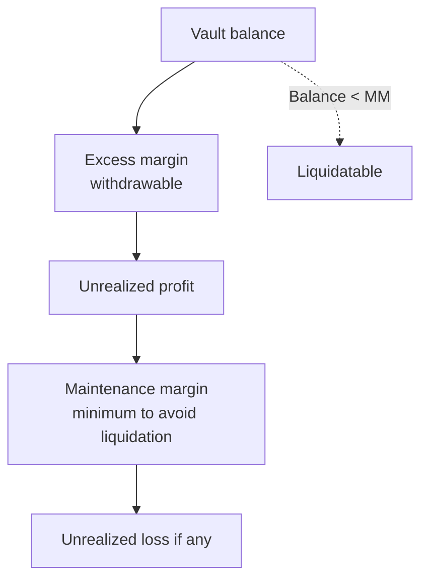
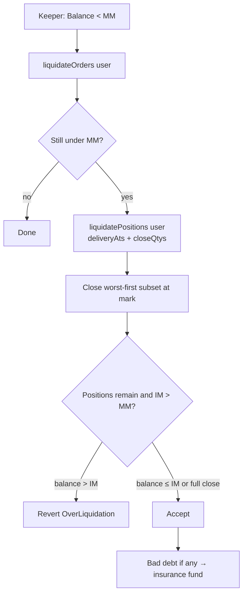

# Margin System

The HPDX Futures margin system ensures all positions are properly collateralized, protecting both parties from counterparty default risk.

> **Contract `3.0.0`.** Positions are unilateral aggregates per `(user, deliveryAt)`.
> Portfolio IM/MM is computed by the Portfolio Margin Engine (PME). There is no
> `deliveryDurationDays` multiplier — each whole contract settles one unit of price.

---

## Overview

Margin is collateral deposited into the Collateral Vault used by Futures. The system
continuously monitors margin levels and automatically liquidates undercollateralized accounts.



---

## Margin Types

### 1. Deposited Collateral (Balance)

The actual token balance held in the vault for the participant.

### 2. Maintenance Margin (MM)

The **minimum collateral** required to hold open exposure without triggering liquidation.
Futures contributes order margin and position stress through the PME; per-contract notional
is price × quantity (no duration factor).

### 3. Initial Margin (IM)

The higher buffer the account should sit at after a partial liquidation. Keepers close
only enough exposure to restore the account into the `[MM, IM]` band when possible.

### 4. Unrealized PnL

For each aggregate:

```
pnl = mark × netQuantity − netEntryValue
```

Profitable exposure reduces effective margin pressure; losses increase it.

---

## Margin Examples

### Example 1: Opening a Long Aggregate

```
Balance:        100.00 USDC
Mark / entry:   4.10 USDC
netQuantity:    +1
netEntryValue:  4.10

Unrealized PnL = 4.10 × 1 − 4.10 = 0
```

Portfolio IM/MM come from the PME shocks applied to the account's net exposure.

### Example 2: Price Moves Against a Short

```
Entry:          4.10   (netQuantity = −1, netEntryValue = −4.10)
Mark:           4.12

pnl = 4.12 × (−1) − (−4.10) = −0.02 USDC   (loss)
```

If vault balance falls below MM, the account is liquidatable.

### Example 3: Price Moves In Favor of a Short

```
Entry:          4.10
Mark:           4.08

pnl = 4.08 × (−1) − (−4.10) = +0.02 USDC   (profit)
```

---

## Liquidations

### What Triggers a Liquidation?

A participant becomes liquidatable when portfolio margin reports:

```
Balance < Maintenance Margin
```

Liquidation is **permissionless**: any address can submit a liquidation transaction once
that condition holds.

> **Keeper incentives are currently disabled.** The `liquidationFee` parameter is retained
> in storage and still appears on liquidation events, but payouts are fixed at `0`.

### Liquidation Process

The **trigger** is an MM breach, but the **goal** is to restore the account to its IM buffer:
liquidation closes only as many contracts (across expiries) as needed to bring the balance
back to (at most) IM — not necessarily the whole book. The keeper selects the worst-first
subset off-chain.



`liquidatePositions(user, deliveryAts[], closeQtys[])` closes the keeper-supplied set in
**one transaction** and reads margin **once** at the end: if any exposure remains and a real
`IM > MM` buffer exists, it reverts `OverLiquidation` when leftover balance ends up **above**
IM. A fully-closed account skips that guard (deep-underwater / bad-debt path). Zero-net or
unknown expiries in the batch are skipped. The single-expiry entry point
`liquidatePosition(user, deliveryAt, closeQty)` remains available.

All entry points revert with `NotLiquidatable` when the target's `Balance ≥ MM`, and position
entry points revert `OrdersStillOpen` while resting orders remain.

---

## Off-chain Keepers

### Role of a Keeper

A keeper is any off-chain service that:

1. **Monitors** participant margin utilization
2. **Alerts** users when utilization exceeds warning thresholds
3. **Submits** `liquidateOrders` / `liquidatePositions` for undercollateralized accounts,
   sizing the worst-first close so the account lands back within the `[MM, IM]` band

Because liquidation is permissionless, there is no privileged validator role for this flow.

### Margin Utilization Calculation

```
Utilization = Min Margin / Balance × 100%

< 80%:    Safe
80-100%:  Warning (notifications sent)
≥ 100%:   Liquidatable by any keeper
```

---

## Best Practices

### For Traders

1. **Monitor Utilization**: Keep utilization below 80% to avoid warnings
2. **Add Buffer**: Deposit more than the minimum required
3. **Set Alerts**: Use the notification service for margin warnings
4. **Act Quickly**: Top up collateral immediately when warned

### For Miners (Sellers)

1. **Account for Volatility**: Hash prices can move significantly
2. **Conservative Sizing**: Don't over-commit production capacity
3. **Settlement Reserves**: Keep extra margin to cover an adverse mark at maturity settlement

### Utilization Guidelines

| Utilization | Status      | Action                    |
| ----------- | ----------- | ------------------------- |
| 0-50%       | Safe        | Normal operation          |
| 50-80%      | Moderate    | Monitor closely           |
| 80-95%      | Warning     | Consider adding margin    |
| 95-100%     | Critical    | Immediate action required |
| >100%       | Liquidation | Liquidatable by any keeper |

---

## Read next

- [Trading Guide](./04.Trading-Guide.md) - Managing orders and positions
- [Settlement](./05.Delivery-Settlement.md) - Cash settlement of positions at maturity
