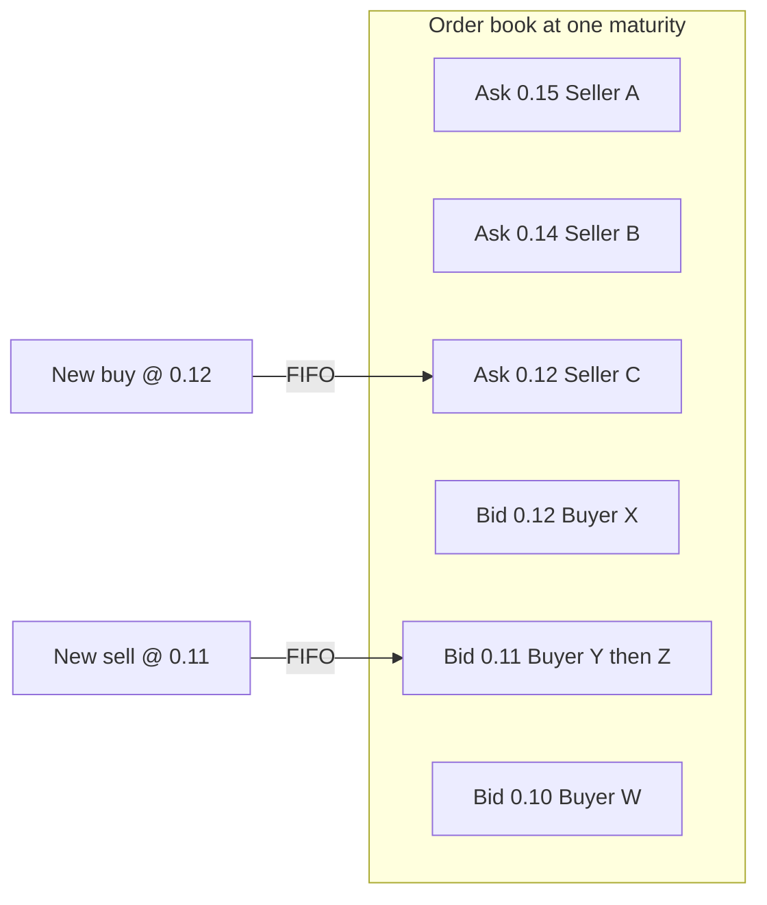
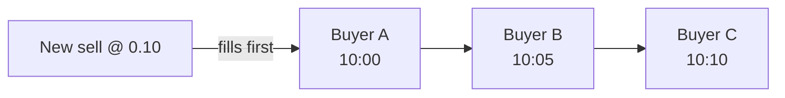

# Trading Guide

This guide explains how to trade on HPDX Hashprice Futures, from placing your first order to managing positions.

> **Contract `3.0.0`.** Orders carry signed whole-contract quantity. Positions are unilateral
> aggregates per `(user, expirationAt)`. Matching updates each side's net independently — there
> are no bilateral lots or destination URLs.

---

## Prerequisites

Before trading, ensure you have:

1. **Settlement Tokens**: USDC or the configured token in your wallet
2. **Wallet Connection**: Connected to the correct network (Base)
3. **Margin Deposit**: Collateral deposited in the Collateral Vault used by Futures

---

## Understanding Order Types

### Long Orders (Buy)

```
createOrder(price, expirationAt, +qty)   // positive = buy / long
```

- Long exposure to hashprice, cash-settled at maturity
- Profit if settlement (or exit) is above entry

### Short Orders (Sell)

```
createOrder(price, expirationAt, -qty)   // negative = sell / short
```

- Short exposure to hashprice, cash-settled at maturity
- Profit if settlement (or exit) is below entry

One placement creates **one** FIFO order node with `|qty|` contracts. Later placements at the
same price do **not** merge into the earlier node.

---

## Order Matching

Orders match when they share price and maturity and have opposite sign. Book priority is FIFO
at each price level.



### FIFO Priority



### Self-Matching Prevention

You cannot match with your own opposite resting order. Placing an opposite order at the same
price cancels your own resting qty instead of creating a self-trade.

---

## Positions (aggregates)

After fills, each user holds at most one aggregate per maturity:

| Field | Meaning |
| ----- | ------- |
| `netQuantity` | Signed whole contracts (+long / −short) |
| `netEntryValue` | Sum of `price × signedFillQty` for open exposure |

```
unrealized / settlement pnl = mark × netQuantity − netEntryValue
```

There is **no** duration multiplier — one contract settles one unit of price.

---

## Closing Positions

### Method 1: Offset Before Maturity

Place an opposite order to reduce `netQuantity` toward zero:

```
Open:  +1 @ 4.10
Close: −1 @ 4.12

pnl = 4.12 − 4.10 = +0.02 USDC per contract
```

### Method 2: Cash Settlement at Maturity

Hold until `expirationAt`. Anyone may call `settlePosition(user, expirationAt)` (typically a keeper).
See [Settlement](./05.Delivery-Settlement.md).

---

## Order Limits & Fees

### Maximum Orders

Each address may have up to `MAX_ORDERS_PER_PARTICIPANT` (100) resting orders. There is no
per-order max qty of 127 — quantity is a signed `int256` of whole contracts.

### Fees

Maker/taker fees are charged on fills (not on resting placements). Defaults may set maker fee to 0.

---

## Read next

- [Settlement](./05.Delivery-Settlement.md) — cash settlement at maturity
- [Event Design Spec](./06.Event-Desing-Spec.md) — `OrderMatched` / `PositionSettled`
