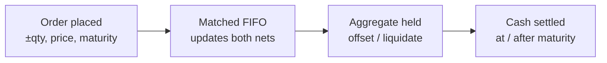
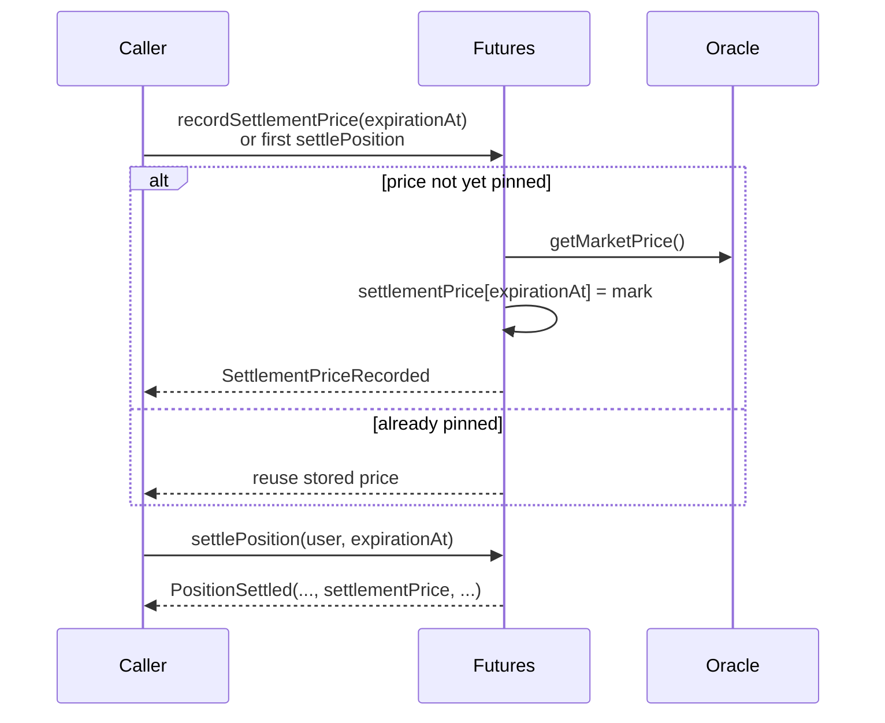
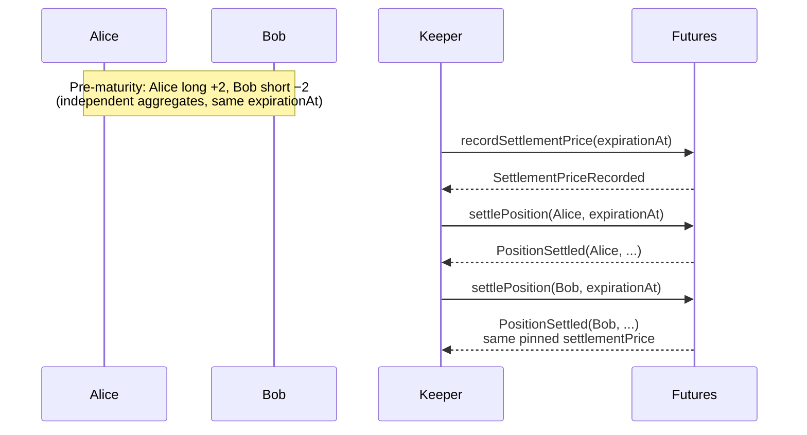

# Settlement

This document explains how futures positions are cash-settled at maturity in HPDX Hashprice Futures.

> **Cash settlement model (contract `3.0.0`).** Positions are **unilateral aggregates** per
> `(user, expirationAt)`. There is no physical hashrate delivery, no escrow, no validator role,
> and no destination URL. At maturity, a single **settlement price** is pinned per expiration;
> each user's aggregate on that expiration is marked to that price independently, and PnL is
> routed through the insurance fund.

---

## Settlement Lifecycle



| Phase | When | What happens |
| ----- | ---- | ------------ |
| Order | Before maturity | Place signed-qty orders |
| Match | Before maturity | FIFO fills update each side's `(netQuantity, netEntryValue)` |
| Hold | Before maturity | Offset via opposite orders, or liquidate if underwater |
| Settle | At/after `expirationAt` | Permissionless mark-to-pinned-price |

---

## Before Maturity

Before an aggregate matures, the holder can:

- **Offset**: Place opposite orders to reduce `netQuantity` toward zero and realize PnL
- **Be liquidated**: Permissionlessly reduced via `liquidatePosition(user, expirationAt, closeQty)`
  if undercollateralized (orders must be cleared first)

No payment, escrow, or destination endpoint is required. The aggregate waits until
`expirationAt` and is then cash-settled.

---

## Settlement at Maturity

Once `block.timestamp >= expirationAt`, a user's non-zero aggregate at that expiry can be settled
at the expiration's **pinned settlement price**.

### Who Can Settle

Settlement is **permissionless**. Anyone — typically an off-chain keeper — can call:

```solidity
function settlePosition(address user, uint256 expirationAt) public;
```

To settle several user+expiry pairs in one transaction:

```solidity
function settlePositions(address[] calldata users, uint256[] calldata expirationAts) external;
```

Lengths must match (`ArrayLengthMismatch` otherwise). Keepers should pre-filter to pairs where
`block.timestamp >= expirationAt` and `getUserPosition(user, expirationAt).netQuantity != 0`.

### Settlement Price Pinning

All aggregates sharing the same `expirationAt` settle against **one** price, recorded the first
time anyone settles (or explicitly pins) that expiration at/after maturity.



Anyone can pin without settling:

```solidity
function recordSettlementPrice(uint256 expirationAt) external;
```

`recordSettlementPrice` reverts with `SettlementDateNotReached` before maturity and is
idempotent once set. Readable via `settlementPrice(expirationAt)` (`0` until recorded).

```solidity
event SettlementPriceRecorded(uint256 indexed expirationAt, uint256 price, address recordedBy);
```

### Collateral Is Held Until Settlement

A matured-but-unsettled aggregate still carries margin until settled. This prevents a losing
party from withdrawing collateral after maturity but before settlement. Once pinned, market risk
is frozen; on settlement the held collateral funds realized PnL.

### How PnL Is Computed

Each whole contract settles one unit of price (no duration multiplier):

```
pnl = settlementPrice × netQuantity − netEntryValue
```

Example — long 1 contract, entry 4.10, pinned settlement 4.30:

```
netQuantity   = +1
netEntryValue = 4.10
pnl = 4.30 × 1 − 4.10 = +0.20 USDC
```

Short of 1 at the same entry realizes −0.20. PnL routes through the **insurance fund**.
After settlement the user's aggregate at that `expirationAt` is cleared
(`netQuantity = 0`, removed from active dates).

### Settlement Event

```solidity
PositionSettled(user, expirationAt, closedQuantity, pnl, settlementPrice, settledBy)
```

Each call settles **one** user's aggregate. Settling Alice does not settle Bob — call once
per `(user, expirationAt)`.

### There Is No Settlement Window

A matured aggregate can be settled **any time** after `expirationAt`. There is no expiry window
or late-settlement penalty; it always settles at the pinned price.

---

## Complete Settlement Flow



---

## Read next

- [Event Design Spec](./06.Event-Desing-Spec.md) - `PositionSettled` / `SettlementPriceRecorded`
- [Trading Guide](./04.Trading-Guide.md) - Offsetting before maturity
