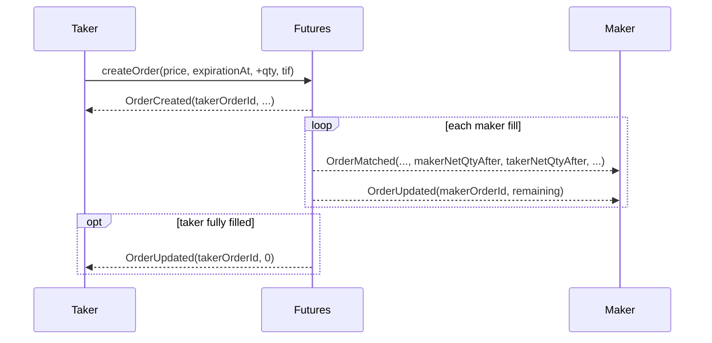

# Futures Event Design Spec

This document is the single source of truth for `Futures.sol` **3.x** events, their
emission order per scenario, and the corresponding indexer entity operations.

> **Aggregate positions + limit order book (contract `3.2.0`).** Positions are unilateral
> aggregates per `(user, expirationAt)` with `netQuantity` + `netEntryValue`. Orders carry
> signed whole-contract quantity (one placement → one FIFO node; same-price placements do
> **not** merge). Incoming limits walk the opposite book to the taker price and fill at each
> **maker** price. Offset, liquidation, and settlement update each party's aggregate
> independently — no bilateral lots, no `destURL`, and no `Lot*` events. Storage/`getOrder`
> use a single `Order` struct (`participant`, `price`, signed `quantity`, `expirationAt`).

---

## Solidity events

```solidity
// ── Orders ─────────────────────────────────────────────────────────────────
event OrderCreated(
    bytes32 indexed orderId,
    address indexed participant,
    uint256 price,
    int256  quantity,      // signed whole contracts (+buy / −sell)
    uint256 expirationAt
);

event OrderUpdated(
    bytes32 indexed orderId,
    address indexed participant,
    int256  newQuantity    // remaining signed qty; 0 when fully filled/cancelled via update path
);

event OrderCancelled(
    bytes32 indexed orderId,
    address indexed participant
);

event OrderMatched(
    bytes32 indexed makerOrderId,
    address indexed maker,
    address indexed taker,
    uint256 expirationAt,
    uint256 tradePrice,
    int256  takerQuantity,           // signed fill qty from taker's perspective
    int256  makerFee,
    int256  takerFee,
    int256  makerNetQtyAfter,        // aggregate after this fill
    int256  takerNetQtyAfter,
    uint256 makerEntryPriceAfter,    // avg entry (|netEntryValue|/|netQty|), 0 if flat
    uint256 takerEntryPriceAfter
);

event OrderLiquidated(
    bytes32 indexed orderId,
    address indexed user,
    address indexed liquidator,
    uint256 fee                      // keeper payout disabled — currently always 0
);

// ── Positions (unilateral aggregates) ──────────────────────────────────────
event PositionLiquidated(
    address indexed user,
    address indexed liquidator,
    uint256 expirationAt,
    int256  closedQuantity,          // signed qty closed toward zero
    int256  pnl,
    uint256 liquidatorFee            // currently always 0
);

event PositionSettled(
    address indexed user,
    uint256 indexed expirationAt,
    int256  closedQuantity,          // net qty settled (signed)
    int256  pnl,
    uint256 settlementPrice,
    address settledBy
);

// ── Settlement price pinning ───────────────────────────────────────────────
event SettlementPriceRecorded(
    uint256 indexed expirationAt,
    uint256         price,
    address         recordedBy
);

// ── Admin / misc ───────────────────────────────────────────────────────────
event BadDebt(address indexed user, uint256 amount);
event ConfigUpdated(Config config);
event HookUpdated(address indexed hook);
```

### Removed in 3.0 (do not index)

`OrderClosed`, `LotCreated`, `LotTransferred`, `LotClosed`, `LotLiquidated`, and all
`destURL` / bilateral lot id fields.

---

## Public API surface (3.0)

```solidity
createOrder(uint256 price, uint256 expirationAt, int256 quantity, TimeInForce tif)
cancelOrder(bytes32 orderId)
getOrder(bytes32) → Order { participant, price, quantity, expirationAt }
getUserOrders(address) → bytes32[]
getUserPosition(address, uint256 expirationAt) → Position { netQuantity, netEntryValue }
getActiveExpirationDates(address) → uint256[]

liquidateOrder(address user, bytes32 orderId)
liquidateOrders(address user)
liquidatePosition(address user, uint256 expirationAt, uint256 closeQty)
liquidatePositions(address user, uint256[] expirationAts, uint256[] closeQtys)

settlePosition(address user, uint256 expirationAt)
settlePositions(address[] users, uint256[] expirationAts)
recordSettlementPrice(uint256 expirationAt)
```

PnL identity for an aggregate: `pnl = mark * netQuantity - netEntryValue`
(whole contracts; no duration multiplier).

---

## State paths and events

### Path 1 — Resting order (no match)

Trigger: `createOrder` with no opposite book.

```
OrderCreated(orderId, participant, price, quantity, expirationAt)
```

Indexer: `OrderEntry{status: ACTIVE, remainingQuantity: |quantity|}`. Upsert `Order` aggregate.

---

### Path 2 — Order cancelled

Trigger: `cancelOrder(orderId)` by owner.

```
OrderCancelled(orderId, participant)
```

(Optional preceding `OrderUpdated(..., 0)` depending on removal path — prefer
`OrderCancelled` / `OrderUpdated(newQuantity=0)` as the close signal; see handlers.)

Indexer: `OrderEntry.status = CANCELLED`; clear remaining quantity.

---

### Path 3 — Expired order cleanup

Trigger: permissionless `removeOutdatedOrder(orderId)`.

```
OrderCancelled(orderId, participant)   // or OrderUpdated(..., 0) — match on-chain emit
```

Indexer: `OrderEntry.status = EXPIRED`.

---

### Path 4 — Immediate / partial match

Trigger: taker `createOrder` crosses resting maker(s).



Indexer:

- Upsert `OrderEntry` for maker/taker; set remaining from `OrderUpdated`.
- Upsert `PositionSession` / trade for **maker** and **taker** using
  `*NetQtyAfter` / `*EntryPriceAfter` (unilateral — no shared lot id).
- Upsert `Fill` / `Trade` from `OrderMatched`.

---

### Path 5 — Offset / reduce (trade against book or self-cancel)

Offsetting reduces the user's aggregate toward zero. Realized PnL is reflected in
vault balances and in post-match `*NetQtyAfter` / entry fields. There is **no**
`LotTransferred` — the counterparty is a separate unilateral aggregate.

Self-cross (maker == taker at any walked level) nets quantities out — emit
`OrderCancelled` / `OrderUpdated` for the resting side, **no** `OrderMatched`, no fees.
Crossed multi-level fills use each maker's price as `tradePrice`.

---

### Path 6 — Order liquidation

Trigger: `liquidateOrder` / `liquidateOrders` while underwater.

```
OrderUpdated(orderId, user, 0)
OrderLiquidated(orderId, user, liquidator, fee=0)
```

Indexer: `OrderEntry.status = LIQUIDATED`. First `OrderLiquidated` /
`PositionLiquidated` in a tx may bump `Futures.totalLiquidations`.

---

### Path 7 — Position liquidation

Trigger: `liquidatePosition(user, expirationAt, closeQty)` or batched
`liquidatePositions` (orders must already be cleared → else `OrdersStillOpen`).

```
PositionLiquidated(user, liquidator, expirationAt, closedQuantity, pnl, fee=0)
```

Only **that user's** aggregate is reduced. Counterparties are unchanged.

Indexer: update `PositionSession` for `user` at `expirationAt`; record PnL.

---

### Path 8 — Cash settlement at maturity

Trigger: permissionless `settlePosition(user, expirationAt)` /
`settlePositions(users[], expirationAts[])`.

First settle (or `recordSettlementPrice`) for an expiry pins the price:

```
SettlementPriceRecorded(expirationAt, price, recordedBy)   // once per expiry
PositionSettled(user, expirationAt, closedQuantity, pnl, settlementPrice, settledBy)
```

Indexer: upsert `FuturesExpiration`; close/update `PositionSession` for that user+expiry;
update `User.realizedPnl`.

---

## Indexer entity model (3.0)

| Entity              | Key                                   | Description                                                                 |
| ------------------- | ------------------------------------- | --------------------------------------------------------------------------- |
| `Order`             | `(tx, user, price, expirationAt, side)` | Placement aggregate in a tx                                                 |
| `OrderEntry`        | `orderId`                             | One FIFO node; `remainingQuantity`                                          |
| `PositionSession`   | `(user, expirationAt)`                  | Unilateral open-to-flat cycle; `netQuantity`, entry, realized PnL           |
| `Trade` / `Fill`    | per match                             | Built from `OrderMatched` (maker/taker legs)                                |
| `LiquidationTx`     | `txHash`                              | Dedupes liquidation counters                                                |
| `FuturesExpiration` | `expirationAt`                          | Pinned `settlementPrice`, `recordedBy`                                      |

`Lot` entity is **retired**. Do not create lots from 3.0 events. Historical lot rows (pre-upgrade)
are orphaned after `resetState` + reindex from the upgrade block.

---

## Event → entity mapping

| Event                     | Entity operation                                                                 |
| ------------------------- | -------------------------------------------------------------------------------- |
| `OrderCreated`            | Create `OrderEntry(ACTIVE)`; upsert `Order`                                      |
| `OrderUpdated`            | Set `remainingQuantity`; if `0`, mark filled/closed                              |
| `OrderCancelled`          | `OrderEntry.status = CANCELLED` (or EXPIRED on sweeper path)                     |
| `OrderMatched`            | Upsert sessions for maker+taker; upsert `Fill`/`Trade`                           |
| `OrderLiquidated`         | `OrderEntry.status = LIQUIDATED`; liquidation tx sentinel                        |
| `PositionLiquidated`      | Update session for `user`@`expirationAt`; liquidation tx sentinel                  |
| `PositionSettled`         | Close/update session; realized PnL; link expiration                              |
| `SettlementPriceRecorded` | Upsert `FuturesExpiration` (first write wins)                                    |

---

## Cutover notes

1. Pause MM / keeper consumers that still call lot APIs.
2. `resetState` all participants (clears orders + aggregates).
3. UUPS upgrade to `3.0.0`.
4. Deploy a **new subgraph** from the upgrade block (do not mix Lot handlers with 3.0 events).
5. Cut over keeper, MM, and UI to the 3.0 ABI (`getUserOrders` / `getOrder`,
   `getActiveExpirationDates` / `getUserPosition`, `settlePosition(user, expirationAt)`,
   `liquidatePositions(user, expirationAts[], closeQtys[])`).

---

## What 3.0 eliminates

- Bilateral lot ids and `Lot*` events
- `destURL` / stratum destination on orders
- Per-unit qty=1 forced placements (orders now carry abs qty)
- Duration multiplier on notional / PnL
- `OrderClosed` reason enum (replaced by `OrderCancelled` / `OrderUpdated` / match path)
